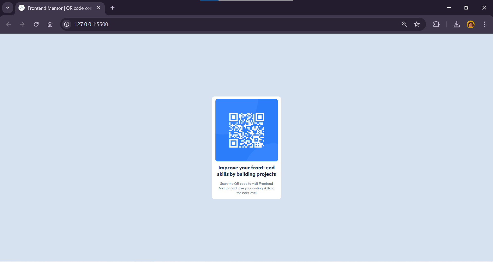

# Frontend Mentor - QR code component solution

This is a solution to the [QR code component challenge on Frontend Mentor](https://www.frontendmentor.io/challenges/qr-code-component-iux_sIO_H). Frontend Mentor challenges help you improve your coding skills by building realistic projects.

## Table of contents

- [Overview](#overview)
  - [Screenshot](#screenshot)
  - [Links](#links)
- [My process](#my-process)
  - [Built with](#built-with)
  - [What I learned](#what-i-learned)
  - [Continued development](#continued-development)
  - [Useful resources](#useful-resources)
- [Author](#author)
- [Acknowledgments](#acknowledgments)

**Note: Delete this note and update the table of contents based on what sections you keep.**

## Overview

This project marks my very first Frontend challenge on Frontend Mentor and is one of the first projects I’ve completed entirely on my own.

### Screenshot

### Links

- Solution URL: [https://github.com/fecroce/qrcodecomponent.git]
- Live Site URL: [https://fecroce.github.io/qrcodecomponent/]

## My process

### 1. **Downloading and Analyzing the Files**

I started by downloading the files provided by Frontend Mentor. Then, I opened and carefully analyzed each folder to understand the structure and resources available.

### 2. **Working with HTML**

Since the HTML was already provided, I began by reviewing it and adding the appropriate classes. I structured the components based on the elements I observed in the example design.

### 3. **Styling with CSS**

After setting up the HTML, I moved on to CSS. My focus was on creating a harmonious design that closely resembled the example provided. I worked to style the components in a way that made the layout cohesive and visually appealing.

### 4. **Adding the Font**

Finally, I added the required font specified in the challenge, ensuring that it matched the design guidelines.

### Built with

HTML5 Semantic Markup – To ensure proper structure and accessibility.
CSS3 – For styling and layout.
Google Fonts – Used the Outfit font family for typography.
Frontend Mentor Starter Files – Resources and guidelines provided by Frontend Mentor to structure the project.
Flexbox
Box Model

### What I learned

Flexbox for Layouts:
I improved my understanding of how to use Flexbox to center elements both horizontally and vertically, as well as how to align and structure elements in a column.

HSL for Colors:
Experimenting with HSL color values allowed me to see how hue, saturation, and lightness work together to create a harmonious color scheme.

Responsive Design Basics:
By using relative units like % and vh, I ensured that the layout adapts well to different screen sizes.

### Continued development

I plan to keep improving my responsive design skills, focusing on advanced techniques like media queries and fluid typography. I also want to refine my CSS practices, exploring methods like BEM for better organization. As I move forward, I’d love to incorporate more interactivity with JavaScript and dive deeper into web accessibility to make my projects more inclusive. I’m excited to explore new CSS features and frameworks to create even more dynamic and polished designs.

### Useful resources

I found the W3Schools Documentation really helpful for quickly looking up syntax and best practices for HTML and CSS. Also GitHub and Frontend Mentor discord group helped me a lot.

## Author

- Name - [Fernanda]
- Frontend Mentor - [@fecroce](https://www.frontendmentor.io/profile/fecroce)
